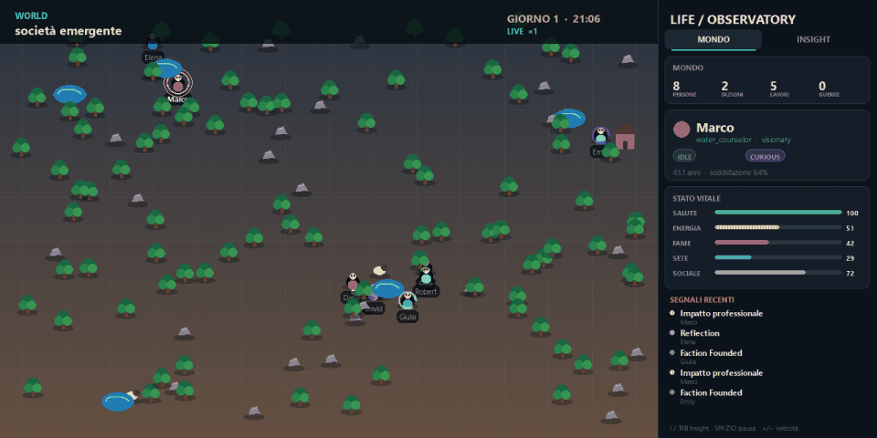

# Game of Life AI

Una sandbox sociale deterministica in cui gli abitanti combinano comportamenti locali e decisioni
generate da un modello Ollama. La simulazione continua a funzionare anche senza AI; il modello viene
usato per obiettivi di alto livello e per proporre nuove professioni, ricette, edifici e regole.

> **Nota sul progetto**
>
> Questo repository è un esperimento estivo, nato per comprendere meglio come usare gli LLM come
> agenti autonomi e come combinarli con Ollama, simulazioni persistenti, comportamenti emergenti e
> limiti di sicurezza. Non è un gioco completo né un programma pronto per l'uso: il codice, le
> meccaniche e l'interfaccia sono strumenti di ricerca e possono essere sostituiti rapidamente quando
> un esperimento suggerisce una direzione più interessante. L'obiettivo principale non è “vincere” o
> offrire una simulazione realistica, ma osservare cosa succede quando un modello interpreta una
> persona, conserva esperienze e prende decisioni capaci di modificare un piccolo mondo condiviso.



## Stato attuale

Il progetto è stato rilanciato su Python 3.12 con un nuovo core event-driven. Sono disponibili:

- osservatorio Pygame con mappa stratificata, schede degli agenti e modalità Insight per leggere
  legami, obiettivi, valori, memorie, sogni, idee attive e impatti professionali;
- umani, mucche, alberi, rocce, laghi ed edifici;
- fame, sete, energia, salute, ciclo vitale e riproduzione;
- raccolta, inventari, cibo consumabile, combattimento, sonno, dialogo, commercio e costruzione;
- memoria breve strutturata e memoria lunga selettiva, con oblio dei dettagli di routine;
- ciclo del sonno `awake -> sleeping -> dreaming`, sogni generati da Qwen e nuovi insight/obiettivi;
- vocazioni dinamiche scelte in base a personalità, competenze, soddisfazione e bisogni collettivi;
- lavori sociali con effetti reali: studioso, guaritore, artista, insegnante, diplomatico e guardia;
- professioni generate da Qwen che possono produrre risorse oppure comporre impatti su conoscenza,
  salute, bisogni, bellezza e relazioni scegliendo destinatari, intensità e raggio entro limiti
  sicuri; i lavoratori raggiungono chi ha davvero bisogno;
- identità individuale con valori, aspirazioni, autoconsapevolezza, crescita, fiducia e stress;
- temperamenti ereditabili ma plastici: esperienze, traumi e relazioni li modificano nel tempo;
- grafo sociale persistente con amicizie, amori, odi, paura, famiglia, mentori e rivalità;
- fazioni, reclutamento, guerre, successione dei leader, pace e dissoluzione dei gruppi;
- azioni emergenti come aiutare, rubare, esplorare, innovare, sabotare, riflettere, raccontare,
  insegnare, studiare, ispirare, curarsi, abbellire, perdonare ed esprimere affetto;
- crisi ambientali periodiche: siccità, incendi, epidemie, raccolti e boom minerari;
- cognizione ibrida con fallback deterministico;
- generazione di regole data-only con validazione, shadow check, monitoraggio e rollback;
- snapshot del mondo, event log e serie storica degli stati mentali in SQLite;
- esecuzione headless riproducibile tramite seed.

L'output del modello non viene mai eseguito come codice: tutte le azioni e le regole passano attraverso
schemi e validatori.

## Requisiti

- [uv](https://docs.astral.sh/uv/)
- Python 3.12 (può essere gestito direttamente da `uv`)
- [Ollama](https://ollama.com/) con `qwen3:8b` per le funzioni generative

```powershell
ollama pull qwen3:8b
uv sync --all-groups
```

## Avvio

```powershell
uv run game-of-life
```

Comandi UI:

- clic su una persona: apre la sua scheda;
- `Spazio`: pausa/riprendi;
- `+` e `-`: velocità della simulazione;
- `I` o `Tab`: alterna tra Mondo e Insight;
- `Esc`: chiude la selezione.

Insight non sostituisce il mondo con un grafo astratto: mantiene persone ed edifici nelle loro
posizioni e sovrappone soltanto le connessioni significative. Selezionando una persona appaiono una
costellazione cognitiva (obiettivo, valore dominante, memoria, sogno e idea), i legami più forti e
le tracce tratteggiate degli effetti prodotti da una professione generata.

Gli agenti in attesa di Ollama mostrano `...` sotto lo sprite; durante il sonno mostrano `zZ` e
durante i sogni `*`. Ogni agente ha uno sprite personale: colore, abito e accessorio cambiano quando
decide di curare il proprio aspetto; gli artisti possono decorare visibilmente gli edifici.
L'inspector visualizza stato cognitivo, memoria breve/lunga, ultimo sogno, conoscenza, stress,
autoconsapevolezza, stile, temperamento, umore, vocazione e obiettivo. Il mondo parte con 8 umani e applica un
limite di 24: le nascite umane richiedono adulti con una relazione reciproca già costruita.

Le conversazioni non sono solo eventi cosmetici: trasmettono valori, aspirazioni e tratti. Aiuto,
tradimento, violenza, creazione, studio, insegnamento e crisi ambientali modificano gradualmente
fiducia, stress, resilienza e temperamento. Gli agenti insoddisfatti rivalutano periodicamente la
propria vocazione; bambini e adulti senza un ruolo studiano per scoprire cosa vogliono diventare.

## Grafo sociale

Ogni relazione è direzionale: Ada può amare Bruno mentre Bruno prova soltanto amicizia, diffidenza
o paura. Il legame non è un singolo punteggio, ma combina:

- `affinity`: simpatia oppure ostilità;
- `trust`: fiducia costruita o tradita;
- `attraction`: interesse romantico;
- `respect`: stima personale e professionale;
- `fear`: timore prodotto da minacce e violenza;
- `familiarity`: quanto i personaggi si conoscono.

Da questi valori e dai ruoli sociali emergono conoscenze, amicizie, amori, odi, rivalità, famiglia,
partner, mentori, studenti e alleanze politiche. Conversazioni, affetto ricambiato o rifiutato,
aiuto, furto, insegnamento, nascita, reclutamento, guerra e pace aggiornano i due versi del rapporto
in modo indipendente.

In modalità Insight la mappa mostra i legami più importanti con colori diversi: rosa per l'amore, azzurro
per la famiglia, verde per l'amicizia, rosso per l'odio, viola per la paura e arancione per le
rivalità. Selezionando un personaggio, il pannello laterale mostra la sua percezione dei rapporti e
i valori di affinità, fiducia, attrazione e paura.

Il ritmo della GUI è 10 tick al secondo a velocità `x1`. Una giornata completa dura 4 minuti reali:
ogni ora del mondo occupa 10 secondi, abbastanza perché Qwen risponda senza far scorrere intere
giornate, ma abbastanza rapidamente da osservare giorno, notte e sogni durante una sessione. Il
mondo parte alle 06:00 e gli abitanti dormono indicativamente dalle 22:00 alle 06:00. Fame e sete
sono calibrate su circa due pasti e due bevute al giorno. Durante il sogno le esperienze importanti
vengono consolidate, quelle banali dimenticate e Qwen può cambiare umore e obiettivo. Senza Ollama
viene usato un sogno deterministico.

Il mondo viene salvato in `saves/world.db`. Per riprendere l'ultimo snapshot:

```powershell
uv run game-of-life --load
```

Senza `--load` il database indicato da `--save` viene ricreato da zero: una nuova simulazione non
mescola mai eventi o snapshot di mondi precedenti.

Le decisioni AI sono interrogabili direttamente nella tabella SQLite `events`:

```sql
SELECT tick, actor_id, action, target_id, payload_json
FROM events
WHERE event_type = 'ai_decision' AND action = 'talk'
ORDER BY sequence DESC;
```

`events` conserva la parte narrativa e causale della simulazione (decisioni AI, conversazioni,
sogni, idee, cambi di obiettivo, relazioni, crisi e conseguenze). Le attività fisiologiche ripetitive
non riempiono più il log: pasti, bevute, raccolta, studio e sonno sono compattati per giorno, persona
e tipo nella tabella `routine_activity`:

```sql
SELECT day, entity_id, activity, detail, count, first_tick, last_tick
FROM routine_activity
ORDER BY day, entity_id, activity;
```

Anche i decessi indicano ora la causa nel payload (`violence`, `starvation`, `dehydration`,
`exhaustion` o `health`):

```sql
SELECT json_extract(payload_json, '$.cause') AS cause, count(*) AS deaths
FROM events
WHERE event_type = 'death'
GROUP BY cause
ORDER BY deaths DESC;
```

Ogni 3 minuti reali (circa diciotto ore del mondo), e alla chiusura, viene salvato lo stato mentale
completo di ogni umano
nella tabella `mental_states`: valori, temperamento, obiettivi, stress, conoscenze, relazioni,
ricordi brevi/lunghi e sogni. Le colonne principali restano direttamente interrogabili:

```sql
SELECT tick, name, profession, mood, goal, self_awareness, stress
FROM mental_states
WHERE entity_id = 'human-000120'
ORDER BY tick;
```

Il documento completo del campione è disponibile in `mental_json`.

Lo stesso campionamento salva il grafo diretto delle conoscenze in `social_edges`. Ogni verso della
relazione mantiene affinità, fiducia, attrazione, rispetto, paura, familiarità, ruoli e numero di
interazioni: due persone possono quindi percepire il loro rapporto in modo diverso. La sua evoluzione
si può interrogare direttamente:

```sql
SELECT tick, source_id, target_id, relationship,
       affinity, trust, attraction, respect, fear, familiarity, interaction_count
FROM social_edges
WHERE source_id = 'human-000120'
ORDER BY tick, target_id;
```

Per vedere soltanto i legami più forti dell'ultimo campione:

```sql
WITH latest AS (SELECT max(tick) AS tick FROM social_edges)
SELECT source_id, target_id, relationship, affinity, trust, attraction, fear
FROM social_edges
JOIN latest USING (tick)
ORDER BY max(abs(affinity), abs(trust), attraction, fear) DESC;
```

Per seguire nel tempo uno specifico rapporto direzionale:

```sql
SELECT tick, relationship, affinity, trust, attraction, respect, fear, familiarity
FROM social_edges
WHERE source_id = 'human-000120' AND target_id = 'human-000121'
ORDER BY tick;
```

I valori correnti sono inclusi anche nello stato mentale del personaggio, mentre `edge_json` conserva
ruoli e cronologia sintetica delle interazioni.

Esecuzione deterministica senza Pygame o Ollama:

```powershell
uv run game-of-life --headless --no-ai --ticks 10000 --seed 42
```

Una run headless con AI procede automaticamente al ritmo reale del mondo (10 tick al secondo), in
modo che Ollama possa rispondere mentre la società evolve. `--fast` disabilita intenzionalmente il
pacing per prove tecniche; le richieste non concluse entro `--ai-wait-seconds` vengono registrate
come cancellate prima dello snapshot finale.

Configurazione tramite variabili d'ambiente:

- `GOL_OLLAMA_MODEL` (default `qwen3:8b`);
- `GOL_OLLAMA_ENDPOINT` (default `http://127.0.0.1:11434`);
- `GOL_AI_ENABLED` (`true`/`false`);
- `GOL_SEED`;
- `GOL_MENTAL_SNAPSHOT_MINUTES` (default `3`, `0` per disabilitare il campionamento periodico).

## Diagnostica

Lo script diagnostico crea sempre una run nuova, verifica l'integrità del database e produce un
report JSON con varietà delle decisioni, completamento delle richieste AI, conversazioni, sogni,
regole generate e impatto reale delle professioni. La modalità offline simula tre giornate senza
attendere il tempo reale; quella AI mantiene il pacing necessario a Ollama e poi aggiunge 1.200 tick
offline veloci, così una professione appena generata ha il tempo di raggiungere qualcuno e produrre
conseguenze osservabili:

```powershell
uv run game-of-life-diagnose --mode offline --days 3
uv run game-of-life-diagnose --mode ai --ticks 300
```

La coda causale si può regolare con `--settle-ticks` (oppure disabilitare con `0`).
Per rigenerare soltanto il report di un database esistente si usa `--analyze-only --save <db>`.

Si può avviare lo stesso strumento anche con
`uv run python scripts/diagnose_run.py`. I database e i report predefiniti sono scritti in `saves/`;
`--save` e `--report` permettono di scegliere percorsi separati per confrontare più esperimenti.

Se una popolazione si estingue, la query sulle cause di morte distingue subito una guerra da un
problema di risorse. Gli attacchi contro umani sono ammessi soltanto in guerra, in presenza di un
grave rancore o per temperamenti eccezionalmente violenti; ogni decisione produce un singolo colpo.
Fame, sete ed esaurimento interrompono sempre un'azione AI ancora in corso, così la sopravvivenza non
rimane bloccata da una decisione generativa ormai superata.

## Sviluppo

```powershell
uv run ruff check .
uv run pytest --basetemp=.pytest-tmp --cov=game_of_life
```

I moduli principali sono:

- `engine.py`: tick, azioni e sistemi simulativi;
- `models.py`: stato tipizzato del mondo;
- `ai/`: client Ollama e worker in background;
- `innovation.py` e `rules.py`: generazione e governance delle regole;
- `persistence.py`: snapshot, eventi e versioni delle regole;
- `ui.py`: rendering e pannelli Pygame.

## Prossime evoluzioni

- mercato con prezzi emergenti e proprietà collettive;
- insediamenti, istituzioni e leggi generate entro effetti sicuri;
- dialoghi multi-turno e memorie condivise tra generazioni;
- stagioni, clima e impatto ecologico;
- tecnologia, cultura e diplomazia tra comunità.
